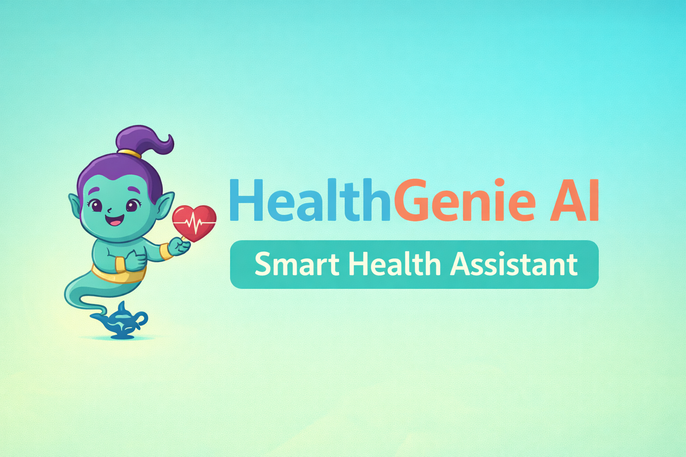

# 🧠 HealthGenieAI


<p align="center">
  
</p>

HealthGenieAI is an AI-powered health and fitness mobile application that helps users track their daily activities, monitor health metrics, and get intelligent recommendations for a healthier lifestyle.

---

## 📱 App Features

### 🔐 Authentication
- Firebase Login & Signup
- Email Verification Required
- Secure user access

---

### 🏃 Fitness Tracking
- Step Counter
- Calories Burned
- BMI Calculation
- Water Intake Tracker
- Goal Setting (Steps & Hydration)

---

### 🤖 AI Features
- AI Symptom Analysis
- AI Diet Plan Generator
- Personalized Recommendations

---

### ⏰ Health Utilities
- Medical Reminder (Notifications)
- Exercise Guidance
- Weekly Health Reports
- Nearby Medical Locations (Maps Integration)

---

## 🧩 Tech Stack

| Technology | Usage |
|----------|------|
| Kotlin | Android Development |
| Firebase Auth | Login/Signup |
| Firestore | User Data Storage |
| Firebase Storage | Profile Images |
| Firebase Analytics | User Tracking |
| Google Maps API | Nearby Locations |
| Retrofit | API Calls |
| Glide | Image Loading |

---

## 🏗️ System Architecture
# 🧠 HealthGenieAI


HealthGenieAI is an AI-powered health and fitness mobile application that helps users track their daily activities, monitor health metrics, and get intelligent recommendations for a healthier lifestyle.

---

## 📱 App Features

### 🔐 Authentication
- Firebase Login & Signup
- Email Verification Required
- Secure user access

---

### 🏃 Fitness Tracking
- Step Counter
- Calories Burned
- BMI Calculation
- Water Intake Tracker
- Goal Setting (Steps & Hydration)

---

### 🤖 AI Features
- AI Symptom Analysis
- AI Diet Plan Generator
- Personalized Recommendations

---

### ⏰ Health Utilities
- Medical Reminder (Notifications)
- Exercise Guidance
- Weekly Health Reports
- Nearby Medical Locations (Maps Integration)

---

## 🧩 Tech Stack

| Technology | Usage |
|----------|------|
| Kotlin | Android Development |
| Firebase Auth | Login/Signup |
| Firestore | User Data Storage |
| Firebase Storage | Profile Images |
| Firebase Analytics | User Tracking |
| Google Maps API | Nearby Locations |
| Retrofit | API Calls |
| Glide | Image Loading |

---

## 🏗️ System Architecture
User
│
▼
Android App (Kotlin)
│
├── Firebase Authentication
├── Firestore Database
├── Firebase Storage
│
├── AI Engine (Symptom + Diet)
│
├── Google Maps API
│
└── Notification System


---

## 🔄 App Flow
Start App
│
▼
Splash Screen
│
▼
Login / Signup
│
▼
Email Verification
│
▼
Dashboard
│
├── Fitness Tracking
├── AI Analysis
├── Diet Plan
├── Reminders
├── Reports
└── Maps


---

## 📸 Screenshots

> Add your screenshots here


/screenshots/home.png
/screenshots/profile.png
/screenshots/ai.png
/screenshots/report.png


---

## 📂 Project Structure


com.healthgenieai.app
│
├── models
├── network
├── ui
│ ├── home
│ ├── fitness
│ ├── diet
│ ├── chat
│ ├── maps
│ └── reminder
│
├── utils
├── LoginActivity
├── SignUpActivity
├── MainActivity
└── SplashActivity


---

## ⚙️ Setup Instructions

1. Clone the repository
```bash
git clone https://github.com/yourusername/HealthGenieAI.git

Open in Android Studio

Add API keys in local.properties

GEMINI_API_KEY=your_key
MAPS_API_KEY=your_key

Connect Firebase

Run the app

🔒 Permissions Used
Permission	Purpose
INTERNET	API Calls
ACTIVITY_RECOGNITION	Step Tracking
LOCATION	Nearby Hospitals
POST_NOTIFICATIONS	Reminders
BODY_SENSORS	Fitness Data
⚠️ Disclaimer

This app is intended for fitness and general wellness purposes only.
It does not provide medical advice, diagnosis, or treatment.

📧 Contact

Developer: Ananta Kumari
📩 Email: kumariananta01@gmail.com

⭐ Contribution

Feel free to fork this repo and contribute!

🚀 Future Improvements

Wearable Integration

Advanced AI Health Reports

Chatbot Assistant

Cloud Sync Improvements


